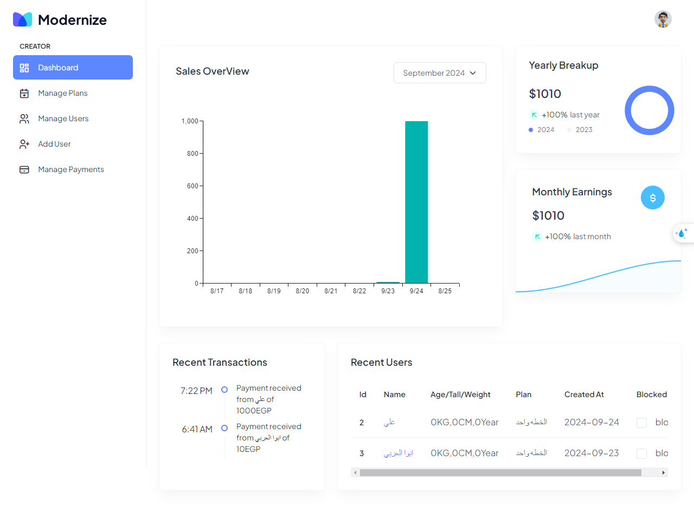
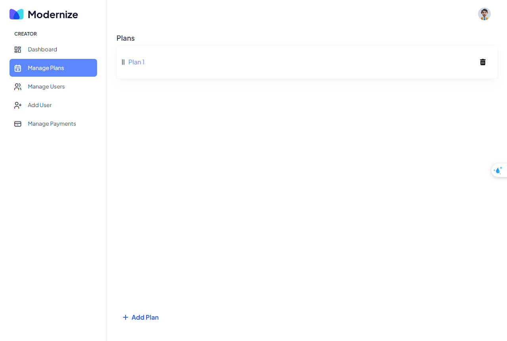
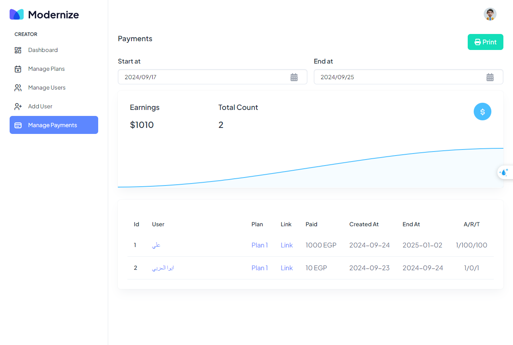

# Gym Membership Admin App



## Overview

The Gym Membership Admin App is a powerful and versatile desktop application designed to simplify the management of gym businesses. Built with cutting-edge technologies such as Electron, Next.js, Express.js, and TypeScript, the app provides gym owners and administrators with an all-in-one solution to manage members, monitor fitness progress, handle payments, and organize membership plans.

Designed with usability and efficiency in mind, the application features a modern, responsive interface crafted with Tailwind CSS, Bootstrap, and MUI components. These technologies ensure a visually appealing and intuitive user experience that works seamlessly on various devices and screen sizes, making it easy for administrators to navigate and manage their operations.

The Gym Membership Admin App centralizes the management of essential gym functions, including creating and managing membership plans, tracking user logs and progress, and handling payment processes. The app allows gym administrators to store comprehensive user data such as weight, height, age, fitness goals, and other personal metrics. This data provides valuable insights that help tailor fitness programs to individual needs and improve the overall gym experience.

One of the standout features of the app is its ability to log user activities and track progress over time, giving administrators and trainers a clear view of each member's fitness journey. The app's payment tracking system ensures smooth financial operations by recording payments, managing subscriptions, and sending alerts for renewals, helping to maintain a steady cash flow.

Additionally, the app supports multi-language functionality, including support for languages like English and Arabic, making it accessible to a broad audience. The backend is powered by Express.js, which handles requests efficiently and securely, while Next.js ensures fast rendering and dynamic content management. The Electron framework enables the app to run as a desktop application, providing the power and flexibility of web technologies in a native desktop environment.

Whether you are managing a small gym or a large fitness center, the Gym Membership Admin App offers the tools you need to keep your operations running smoothly. It streamlines administrative tasks, enhances member engagement, and ultimately helps you deliver a better fitness experience.

Key benefits include:

- Centralized management of user profiles, membership plans, and payments.
- Real-time tracking of user activity and progress.
- Enhanced communication with members through clear insights into their fitness data.
- A modern, responsive design that ensures a seamless user experience.
- A secure and reliable platform built with industry-standard technologies.

The Gym Membership Admin App is the ultimate solution for gym management, helping you save time, reduce administrative burdens, and focus on what matters most—providing an exceptional fitness experience for your members.

## Features

- **User Management**: Add, edit, and manage user profiles, including storing detailed information such as weight, height, age, and fitness goals.
- **Plan Management**: Create and manage various gym plans, including membership tiers, class schedules, and personalized fitness programs.
- **Payment Tracking**: Keep track of user payments, view payment history, and manage subscription renewals.
- **Logs and Progress Tracking**: Monitor user activity logs, track progress over time, and provide insights into user performance and attendance.
- **Multi-Language Support**: Supports multiple languages, making the app accessible to a diverse audience (e.g., English, Arabic).
- **Responsive Design**: The interface is designed with Tailwind CSS, Bootstrap, and MUI components to ensure a smooth and consistent user experience across different devices.
- **Built with Modern Technologies**: Utilizes Electron for desktop application capabilities, Next.js for fast and SEO-friendly rendering, and Express.js for robust backend functionality.
- **Data Security**: Securely manages user data with best practices to ensure privacy and compliance.
- **Customizable Settings**: Easily configure gym settings, plan details, and user permissions to tailor the app to your business needs.

## Getting Started

To run the project locally, follow these steps:

1. Clone the repository:

   ```shell
   git clone https://github.com/Emam546/GymMemberShip
   ```
2. Install the dependencies:

   ```shell
   npm install
   ```

3. Start the development server:

    ```shell
   npm run dev
   ```

